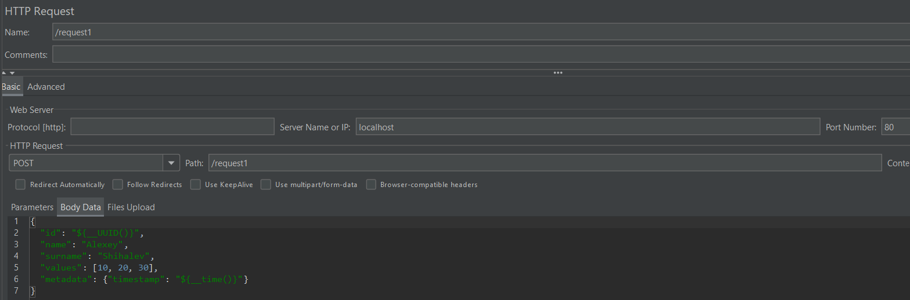
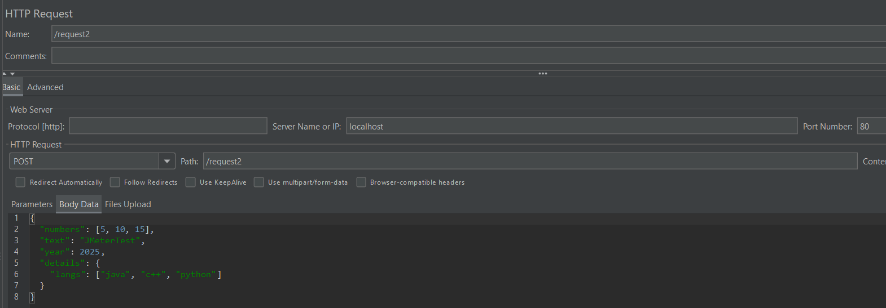
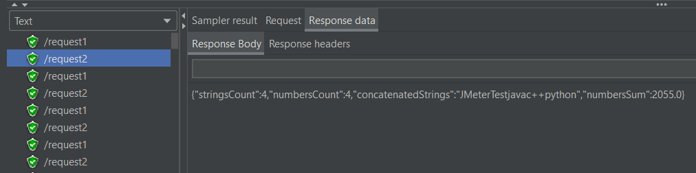

# Нагрузочное тестирование HttpServer

## Структура проекта

Проект включает в себя:

- Реализация HTTP-сервера (Лабораторная №2), поддерживающего:
    - **Запрос 1**: Принимает запрос, парсит JSON, сохраняет данные в файл и считывает их обратно
    - **Запрос 2**: Принимает запрос, парсит JSON, выполняет вычисления над данными, формирует и возвращает JSON-ответ
- Реализация собственного JSON-парсера (Лабораторная №1) и возможность переключения между:
    - `JsonParser` (собственная реализация)
    - Библиотека `Jackson`
- Поддержка выбора между виртуальными и классическими потоками
- Нагрузочное тестирование с использованием **Apache JMeter**

## Требования

- **Java 21+**  
  Скачать: https://www.oracle.com/java/technologies/downloads/

- **Maven 3.9+**  
  Скачать: https://maven.apache.org/download.cgi

- **Apache JMeter 5.6+**  
  Скачать: https://jmeter.apache.org/download_jmeter.cgi

## Настройка проекта
   Убедитесь, что модули `HttpServer` и `JsonParser` (из Лабораторных №2 и №1) скомпилированы.
   Зависимости подключаются путем добавления локальных `.jar` файлов в `pom.xml` следующим образом:

   ```xml
   <dependency>
        <groupId>ru.spbstu.telematics.java.server</groupId>
        <artifactId>http-server</artifactId>
        <version>1.0-SNAPSHOT</version>
   </dependency>
   ```
## Запуск сервера

1. Откройте проект `3`.
2. Установите параметры:
    - `useJackson`: `true` — использовать Jackson, `false` — использовать свою реализацию `JsonParser`
    - `isVirtual`: `true` — использовать виртуальные потоки, `false` — классические потоки
3. Запустите `main`-метод в классе `Main`.

Если всё выполнено правильно, в консоли появится сообщение:  
**"Сервер запущен на localhost:80"**

## Проведение нагрузочного тестирования через JMeter

1. Запустите JMeter: файл `bin/jmeter.bat`
2. Откройте план тестирования JMeter.
3. В разделе **Test Plan**:
    - Добавьте **Thread Group**:
        - **Number of Threads (Users)**: `100`
        - **Ramp-Up Period (seconds)**: `10`
        - **Loop Count**: `10`

4. Добавьте HTTP-запросы:
    - Правый клик по **Thread Group** → **Add → Sampler → HTTP Request**
    - **Request 1**:
        - **Method**: `POST`
        - **Path**: `/request1`
        - **Server Name or IP**: `localhost`
        - **Port Number**: `80`
      - **Body Data**:
        ```json
        {
           "id": "${__UUID()}",
           "name": "Alexey",
           "surname": "Shihalev",
           "values": [10, 20, 30],
           "metadata": {"timestamp": "${__time()}"}
        }
           ```
          
        *Конфигурация HTTP-запроса Request 1 в JMeter*
      - **Request 2**:
        - **Method**: `POST`
        - **Path**: `/request2`
        - **Server Name or IP**: `localhost`
        - **Port Number**: `80`
        - **Body Data**:
          ```json
          {
            "numbers": [5, 10, 15],
            "text": "JMeterTest",
            "year": 2025,
            "details": {
            "langs": ["java", "c++", "python"]
          }
          ```
            
          *Конфигурация HTTP-запроса Request 2 в JMeter*
          
5. Добавьте **HTTP Header Manager**:
    - Правый клик по **Thread Group** → **Add → Config Element → HTTP Header Manager**
    - Добавьте заголовок:
        - **Name**: `Content-Type`
        - **Value**: `application/json`
    
6. Добавьте **JSON Assertion** для проверки корректности ответа:
    - Правый клик по нужному **HTTP Request** → **Add → Assertions → JSON Assertion**
    - В поле **JSON Path Expressions** укажите путь к проверяемому элементу, например, `$.numbersCount`.
    - Если нужно, в поле **Expected Value** введите регулярное выражение или ожидаемое значение.
    
7. Добавьте **Listener** для просмотра результатов:
    - **Add → Listener → Summary Report** и **View Results Tree**

8. Запуск теста:
    - Нажмите на зелёную кнопку запуска.  
      После завершения теста результаты отобразятся в выбранных Listener.

## Результаты тестирования

  
*Пример тела ответа от сервера для запроса Request 2*

| Запрос         | Виртуальные + JsonParser | Виртуальные + Jackson | Классические + JsonParser | Классические + Jackson |
|----------------|--------------------------|-----------------------|---------------------------|------------------------|
| Request-1      | 5 мс                     | 4 мс                  | 5 мс                      | 8 мс                   |
| Request-2      | 1 мс                     | 1 мс                  | 1 мс                      | 2 мс                   |

### Анализ

1. **Виртуальные потоки против классических**
    - **Request 1**:
        - С `JsonParser`: производительность одинакова (5 мс)
        - С `Jackson`: виртуальные потоки (4 мс) работают быстрее, чем классические (8 мс) — **в 2 раза**
    - **Request 2**:
        - Производительность практически одинакова во всех режимах:
            - Виртуальные потоки: 1 мс
            - Классические потоки: 1 мс с `JsonParser` и 2 мс с `Jackson`

2. **Собственная реализация `JsonParser` против Jackson**
    - **На виртуальных потоках**:
        - Request 1: `Jackson` (4 мс) немного быстрее `JsonParser` (5 мс)
        - Request 2: одинаковое время — 1 мс
    - **На классических потоках**:
        - Request 1: `JsonParser` (5 мс) быстрее `Jackson` (8 мс)
        - Request 2: `JsonParser` (1 мс) быстрее `Jackson` (2 мс)

### Вывод

- На **Request 2** и при использовании **виртуальных потоков** все конфигурации демонстрируют высокую производительность.
- На **Request 1** `Jackson` показывает лучшее время при использовании виртуальных потоков, в то время как собственная 
реализация `JsonParser` выигрывает при использовании классических потоков.